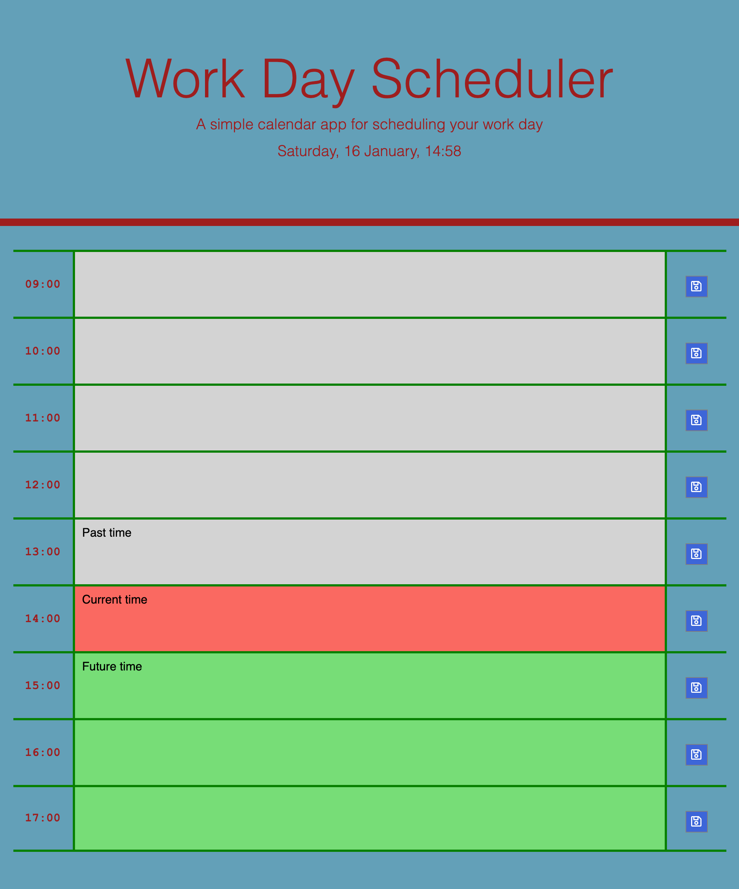

# Work Day Scheduler

### URL to view deployed application: https://mj-0001.github.io/work-day-planner/

## Screenshot of deployed application:  

## Technologies used
* HTML
* CSS
* Bootstrap CSS framework
* JavaScript
* jQuery

## Purpose of application
* The application allows the user to input tasks for the working hours of
09:00 - 17:00 in order to organise their working day effectively.
* The tasks are added to the browser's local storage when the user clicks the 
save button. When the page is reloaded the tasks remain in the boxes.

